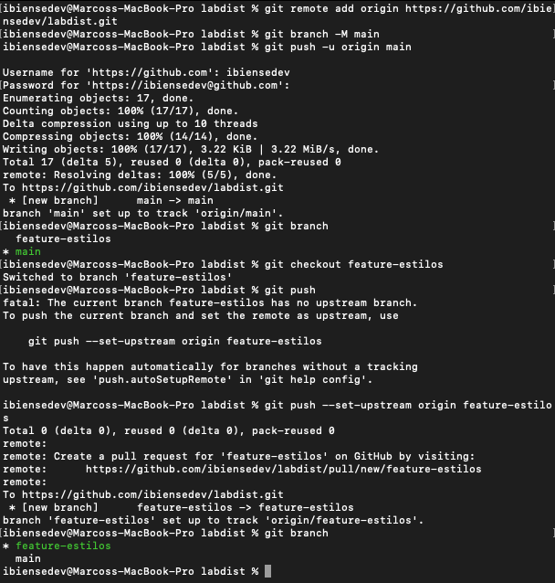
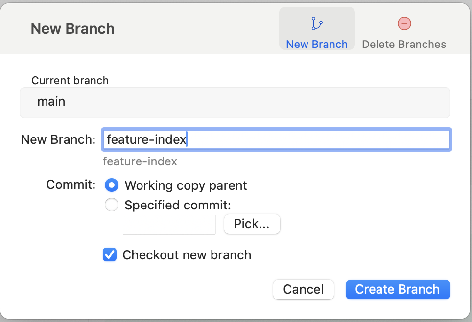
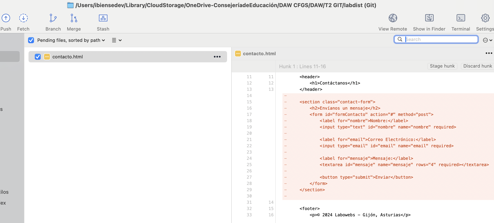
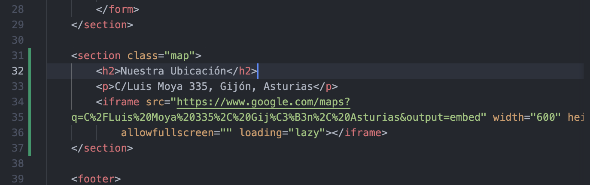

# Documentación de la Actividad Evaluable 2 - Git - DAW Distancia - CIFP Sect. Industrial y Servicios - La Laboral

# Marcos Fernández Sánchez

## Índice
  - [Trabajo en local](#1-trabajo-en-local)
  - [Trabajo en remoto](#2-trabajo-en-remoto)
  - [Conflictos](#3-conflictos)
  - [URL repositorio GitHub](#4-url-repositorio-github)
  - [Videoclip](#5-videoclip)

## 1. Trabajo en local

Antes de comenzar escribimos el siguiente comando para que el historial de ramas de Git se mantenga como un árbol.
```bash
git config --global merge.ff false
```


### 1.1. Inicializa un nuevo repositorio Git en una carpeta llamada "labdist" y agrega los archivos proporcionados en el aula virtual. Renombra la rama master a main, si es necesario. Realiza el primer commit. Muestra el log del repositorio.

Se inicializa el repositorio, se renombra la rama a main, se hace el primer commit del repositorio y se muestra el log.

```bash
git init
git branch -M main
git status
git add .
git commit -m "Primer commit"
git log --oneline --graph --all
```


### 1.2. Incluye un fichero .gitignore para que los ficheros README.md, LICENCE.txt y passwords.txt sean ignorados por el control de versiones. Realiza el commit y muestra los logs del repositorio en una línea.

Se incluye el fichero .gitignore, se añaden los ficheros para ser ignorados. Como se ignoran todos los cambios, no hay nada para realizar el commit. Se muestran los logs sin cambios.

```bash
touch .gitignore
nano .gitignore
git add .gitignore
```


### 1.3. En el repositorio, crea los archivos README.md, LICENCE.txt y passwords.txt con algún contenido. Muestra el estado del repositorio. Muestra el listado de archivos ignorados.

Se realiza la instalación del gestor de bases de datos SQL MariaDB, se verifica su funcionamiento y se accede a la consola. Se comprueba la versión.

```bash
echo "Este es el fichero README" > README.md
echo "Este es el fichero LICENCE" > LICENCE.txt
echo "Este es el fichero passwords" > passwords.txt
git status
git ls-files --others --ignored --exclude-standard
```


### 1.4. Crear una rama y modificar estilos.

#### 1.4.1. Crea una rama `feature-estilos`. Cámbiate a ella.

#### 1.4.2. Modifica el archivo `estilos.css`:
- **Propiedad `color` del `body` y de `h2`:** `#2a2a2a`.
- **Propiedad `background-color` de `header` y `footer`:** `#2a75ff`.

#### 1.4.3. Comprueba el estado del repositorio.
- Añade los cambios.
- Realiza un commit con el mensaje: `"actualizados estilos a azules"`.

Se crea la rama indicada, se modifica el archivo estilos.css y se muestra el estado del repositorio.

```bash
git checkout -b feature-estilos
git status
git add css/estilos.css
git commit -m "actualizados estilos a azules"
git log --oneline
```


### 1.5. Vuelve a la rama main. En el archivo index.html añade un comentario donde se indique tu nombre como autor de la página. Comprueba el estado del repositorio. Añade los cambios, realiza un commit con el mensaje 'añadido autor en index'. Muestra los logs del repositorio en una línea, gráficamente y con 'decoración'.

Se cambia a la rama main, se hacen los cambios indicados en index.html, se realiza commit y se muestran los logs de repositorio de forma gráfica.

```bash
git checkout main
git status
git commit -m "añadido autor en index"
git log --oneline --graph --decorate --all
```


### 1.6. Fusiona la rama feature-estilos en la rama main. Muestra los logs del repositorio en una línea, gráficamente y con 'decoración'.

Se realiza el merge de la rama feature-estilos con la main y se muestran los logs de repositorio gráficamente.

```bash
git merge feature-estilos
git log --oneline --graph --decorate --all
```


## 2. Trabajo en remoto

### 2.1. Continúa con el repositorio labdist. Añade el repositorio a Sourcetree.

Se añade el repositorio a Sourcetree.


### 2.2. En tu cuenta de GitHub, crea un repositorio remoto y sube al remoto los ficheros de tu repositorio local. Debes subir todas las ramas. Muestra, además, la captura de pantalla donde se vean en GitHub, algo similar a esto:

Se crea un repositorio remoto en GitHub, se crea un token para la autenticación y se suben todas las ramas del repositorio local al remoto.

```bash
git remote add origin https://github.com/ibiensedev/labdist.git
git branch -M main
git push -u origin main
git checkout feature-estilos
git push --set-upstream origin feature-estilos
```





### 2.3. En el repositorio local, crea una rama feature-index. Añade el siguiente código dentro de la <section class="about">.Añade los cambios y crea un commit con el mensaje "Añadido párrafo equipo en index.html". Sube los cambios al remoto. (Recuerda que debes usar SourceTree en todo este apartado)


Se crea la nueva rama mediante Sourcetree, se añaden las modificaciones a index.html, se realiza el commit y se suben los cambios al remoto.




### 2.4. En el repositorio local, fusiona la rama feature-index en la rama main.

Se realiza el merge de la rama feature-index con main en local.


### 2.5. Edita el fichero contacto.html. Borra unas líneas. Muestra los ficheros con cambios pendientes y las diferencias. Añade los cambios y haz un commit.

Se edita el fichero contacto.html, se muestran los ficheros con cambios pendientes y sus diferencias, se hace un commit.




### 2.6. Te das cuenta del error. Deshaz TOTALMENTE el commit anterior. Captura el estado actual del repositorio. (Asegúrate de que el fichero contacto.html ha recuperado todas las líneas borradas y no hay cambios pendientes en el repositorio.)

Se hace un reset al commit anterior para deshacer totalmente el realizado por error. Comprobamos que los cambios en contacto.html han sido revertidos satisfactoriamente.


### 2.7. Crea una rama feature-mapa y cámbiate a ella. Incluye este código en el archivo contacto.html. Añade los cambios. Realiza un commit.


Se crea la nueva rama indicada, se incluye el código en contacto.html y se hace un commit de los cambios.





### 2.8. Sube los cambios al remoto - los de todas las ramas. Muestra en el remoto los cambios del archivo contacto.html en la rama feature-mapa.

Se suben todos los cambios al remoto de todas las ramas y se muestran los cambios de contacto.html en feature-mapa.


### 2.9. En GitHub, en la rama main, fusiona la rama feature-mapa. Baja los cambios del remoto a local. Deja los dos repositorios sincronizados. Muestra una captura de pantalla donde se vea la página principal de tu repositorio remoto.

Se hace el merge de la rama feature-mapa con main en GitHub, para ello se crea una pull request y a continuación se realiza un merge pull request, tras confirmar se realiza el merge satisfactoriamente. Una vez finalizado, hacemos fetch desde el local para comprobar si hay cambios en el remoto, como hay cambios los bajamos mediante un pull sobre la rama main. Se muestra la pantalla principal del repositorio remoto en GitHub.


## 3. Conflictos

### 3.1. Crea una rama hotfix-js. Cámbiate a ella. Añade este código en el fichero script.js. Confirma el cambio y haz un commit con el mensaje "corregido problema en script.js". (Fíjate en los números de línea de tu editor...)


Se crea la rama hotfix-js, se añade el código indicado en el fichero script.js y se hace el commit de los cambios realizados.


### 3.2. Vuelve a la rama main. En el fichero script.js en las mismas líneas que en la cuestión anterior, añade el código siguiente. Confirma el cambio y haz un commit con el mensaje "corregido problema en script.js rama main".

Se vuelve a la rama main, se realizan los cambios requeridos y se hace commit de los cambios.


### 3.3. Fusiona la rama hotfix-js en main. Debe producirse un conflicto. Resuélvelo como consideres oportuno. Cuando termines la resolución del conflicto sube los cambios al remoto.

Se realiza el merge de la rama hotfix-js en main, se resuelve el conflicto y se suben todos los cambios realizados al repositorio remoto.


  
## 4. URL repositorio GitHub

Se facilita acceso a la profesora Inés, de Despliegue de Aplicaciones Web, al repositorio de GitHub.


- [Url repositorio GitHub](https://github.com/ibiensedev/labdist.git)

## 5. Subida de documentación

Se sube la documentación de la tarea al repositorio local y, a continuación, al remoto.

## 6. Videoclip
- [Videoclip]()